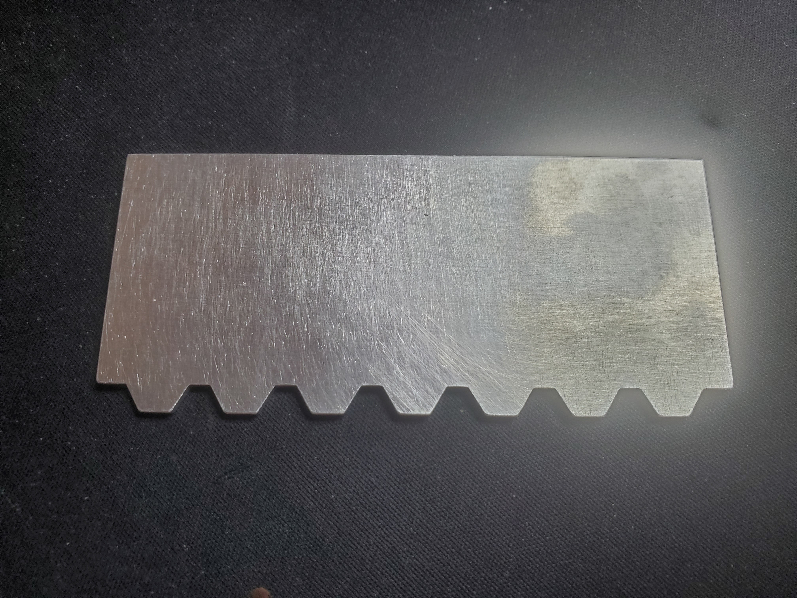
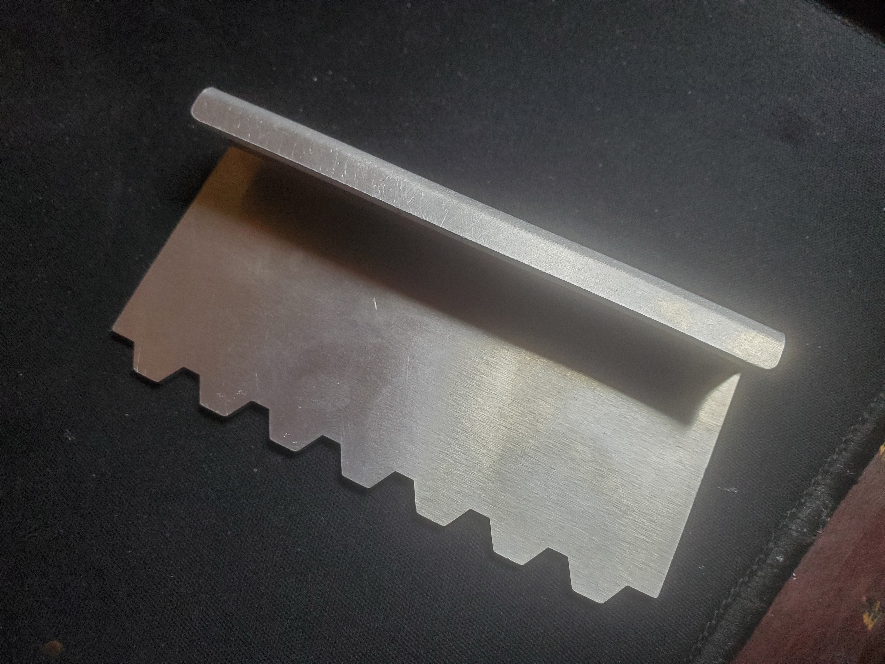

# Balpreet Tools - Sheet metal

Sheet metal designs based on designs in [tool-generator](../tool-generator/) directory.

## Design method

1. Open [FreeCAD](https://www.freecad.org/)
2. Create new document
3. Create new body
4. Import SVG from the [tool-generator/exports](../tool-generator/exports) directory
    1. Select "SVG as geometry (importSVG)" option when importing
5. Change to the "Draft" workbench
6. Select imported path and convert it to a sketch with the "Modification -> Draft to Sketch" tool
7. Delete the imported path
8. Move the sketch into the body
9. Change to the "Part Design" workbench
10. Select the sketch and "pad" it to the desired thickness (I used 2mm for most designs)
11. Add some fillets to the edges if desired
12. For the folded designs:
    1. Change to the "Sheet Metal" workbench
    2. Add a 13mm wall to the top edge of the pad
    3. Add a 5mm wall to the front edge of the previous wall
    4. Add some fillets to the corners of the last wall

## Example builds

The following examples were made by JLC in February/March 2026.

| File                                | Material       | Finish | Photo                                                                                   |
|-------------------------------------|----------------|--------|-----------------------------------------------------------------------------------------|
| `tools-100-40-5-7hex10-nofold.step` | 5052 aluminium | None   |  |
| `tools-100-40-5-7hex10.step`        | 5052 aluminium | None   |         |
